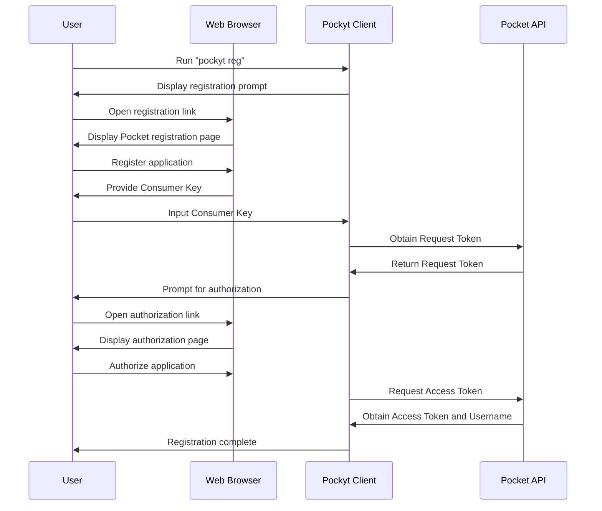
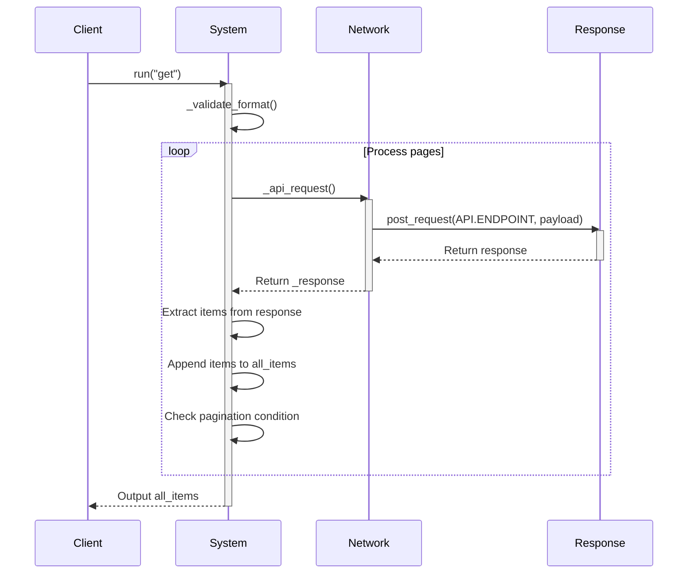
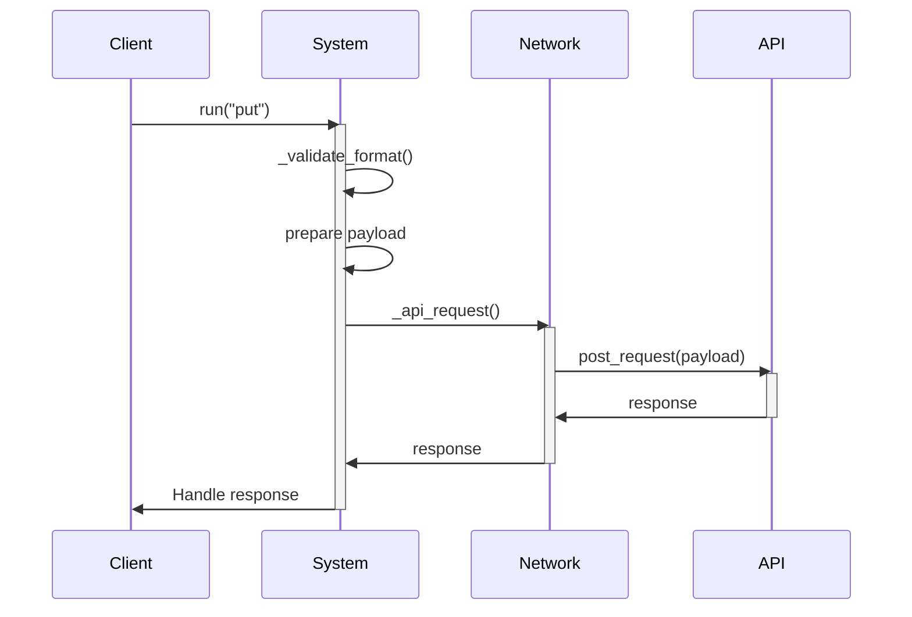
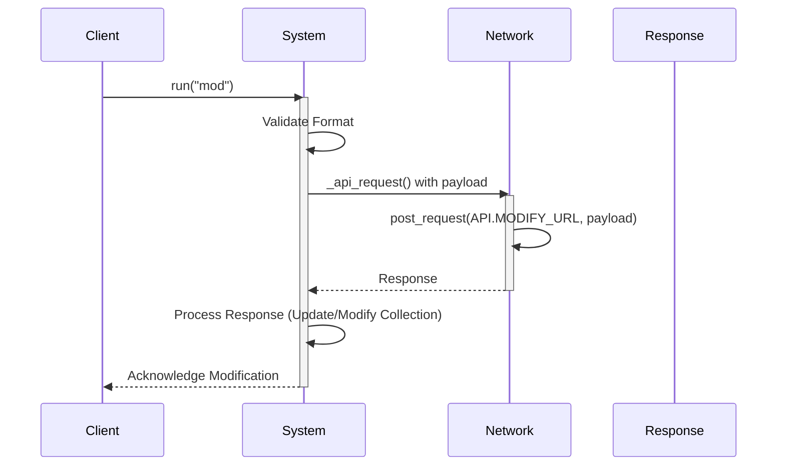

Pockyt Interaction Diagrams
-------------

### reg
Connecting pockyt to a Pocket account.

### get
get pocket collection, with useful item info

### put
add to pocket collection, using links

### mod
modify pocket collection, using item ids

